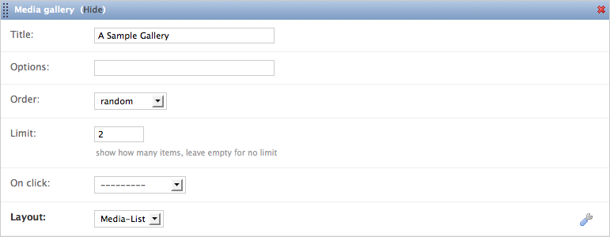
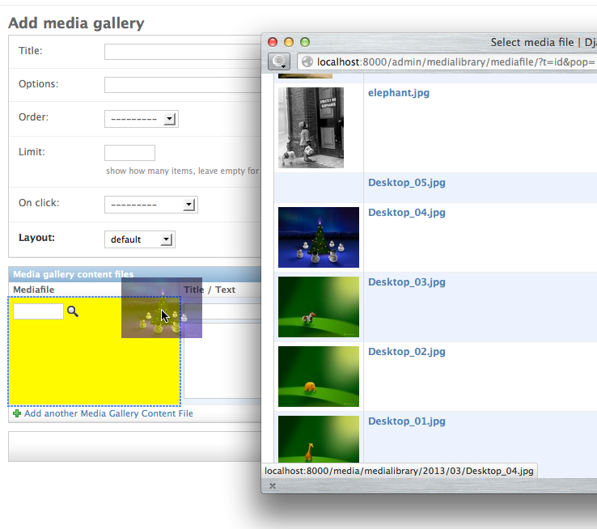

Admin Interface
===============

The MediaGalleryContent configuration has been separated into two stages
for ease of use.

Basic Configuration
~~~~~~~~~~~~~~~~~~~

First, the basic parameters of a media gallery are defined inline in the
page the content has been added to:

The parameters are:

``Title``:
    Title to show

``Options``:
    (Currently unused :-) Rendering options for the gallery.
    Probably a JSON formatted string of parameters
    to pass through to the template.

``Order``:
    How to order the items in the gallery. Choices are `ascending`,
    `descending` and `random`.

``Limit``:
    How many items to show. This parameter can be used in conjunction with
    the `random` Order parameter to show a random selection out of a given
    list, for example show three random products out of a larger selection.

``On Click``:
    What should happen if the user clicks on a gallery item. Possible choices
    are `nothing`, `redirect to related page` and `zoom image`.
    Those actions need to be implemented in the templates.

``Layout``:
    The template to use for rendering the gallery,
    see :ref:`label-installation-layout-choices`.

.. note::
    Note that ``Options``, ``On Click`` and ``Title``
    are passed through as context variables to the template;
    it is the template's job to interpret those as it sees fit.

Content Configuration
~~~~~~~~~~~~~~~~~~~~~

After the basic parameters are set, you will have to define what the
MediaGalleryContent should show.

