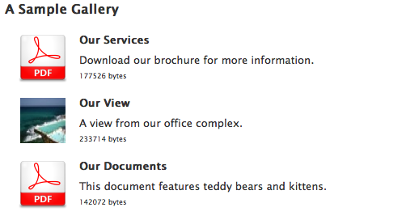

Customisation
=============

.. _label-customisation-templates:

Templates
---------
To customise the look of a media gallery, you will have to create a template
that matches the layout ``key`` as defined during configuration in
:ref:`LAYOUT_CHOICES<label-installation-layout-choices>`.
The render phase will try to use the following templates:
:file:`content/modest/content-%(layout_key)s.html`
and, as fall back only, :file:`content/modest/content.html`.

Included are a simple :file:`content.html` to illustration how to access
the gallery items, and a more elaborate :file:`content-media-list.html`
that displays a simple list of media assets for downloading:

New Layouts
~~~~~~~~~~~

To add a new layout, you will have to:

* Create a new template
  TODO: List of context variables available.
  TODO: Please see examples
* Enable that layout in your
  :ref:`LAYOUT_CHOICES<label-installation-layout-choices>` option
  when registering the content type.

.. _label-customisation-itemclass:

Using alternative item classes
------------------------------

.. _label-customisation-acceptor:

Extending drag and drop
-----------------------
Drop Acceptor
-------------

