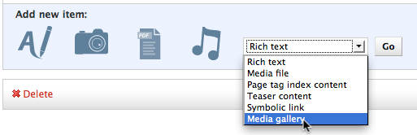

Installation
============
To install this module, simply::

    $ pip install feincms-modest

Then add ``'modest'`` to your ``INSTALLED_APPS``. Finally, install the
content type into your FeinCMS site::

    from modest.models import MediaGalleryContent

    Page.create_content_type(MediaGalleryContent,
                         LAYOUT_CHOICES=(('', 'default'),
                                         ('media-list', 'Media-List')
                         ))

Done. You should now be able to add a `Media Gallery` content to your
cms pages.

Options
-------
On creation, the MediaGalleryContent accepts the following additional
parameters:

.. _label-installation-layout-choices:

``LAYOUT_CHOICES``:
  A list of tuples describing what presentation styles should be available.
  The first item in the tuple is used to select which template will be
  used in the render phase, the second item is the human friendly display
  name that will appear in the admin interface.
  See the section about :ref:`label-customisation-templates`.

``DROP_ACCEPTOR``:
  A filter responsible for taking a URL and converting it to a MediaFile.
  This is used for the drag and drop operation in the admin interface (XXX LINK)

``EXTRA_CONTEXT``:
  You can pass in either a ``dict`` or a callable returning a dict here.
  The dictionary will be injected into the template render phase and will
  thus be available in the template.
